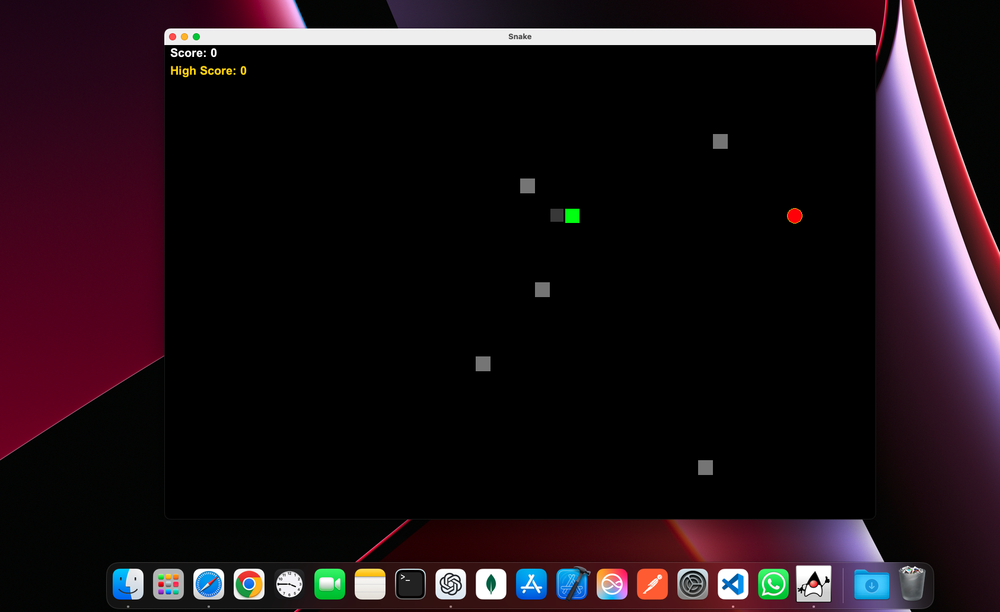
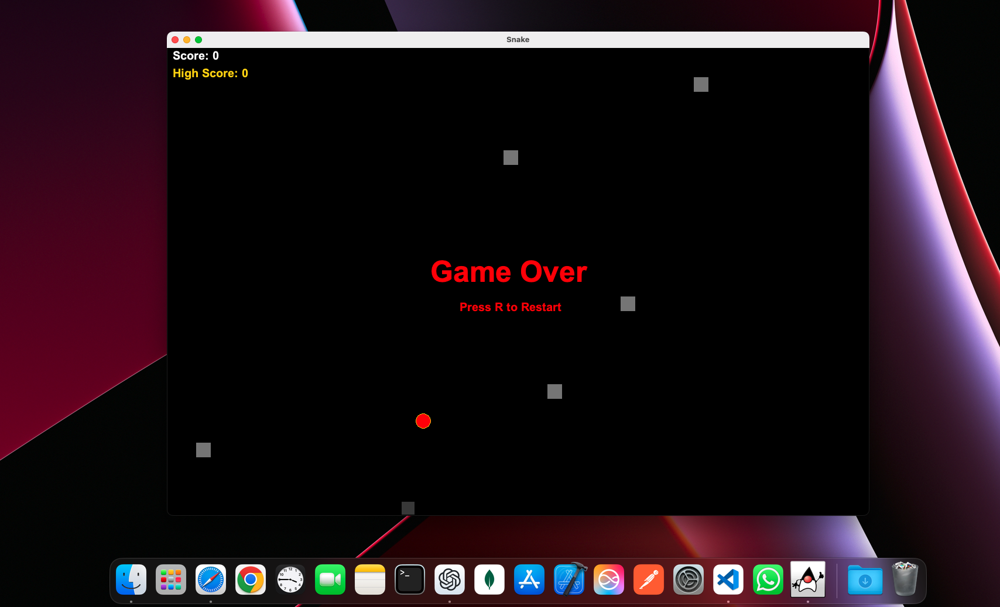

# Snake Game

This is a simple Snake Game implemented in Java using Swing for the graphical user interface. The game includes features such as obstacles, a high score tracker, and a pause/resume functionality.

## Features

- **Snake Movement**: Control the snake using the arrow keys.
- **Food**: The snake grows when it eats food, and the score increases.
- **Obstacles**: Randomly placed obstacles that the snake must avoid.
- **Pause/Resume**: Press `ESC` to pause or resume the game.
- **Game Over**: The game ends if the snake collides with the walls, itself, or an obstacle.
- **High Score**: The highest score achieved is tracked and displayed.

## Controls

- **Arrow Keys**: Move the snake.
- **ESC**: Pause/Resume the game.
- **R**: Restart the game after a game over.

## How to Run

1. Ensure you have Java installed on your system.
2. Compile the Java files:
   ```sh
   javac SnakeGame.java App.java
   ```
3. Run the game:
   ```sh
   java App
   ```

## Code Structure

- **App.java**: The main class that sets up the JFrame and adds the SnakeGame panel.
- **SnakeGame.java**: The main game logic and rendering.

## Screenshots

# Game



# Game Over


## License

This project is licensed under the MIT License.
